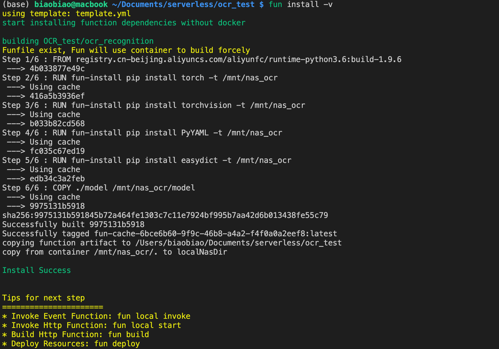
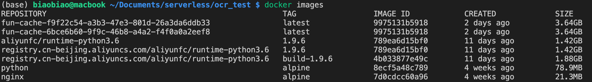
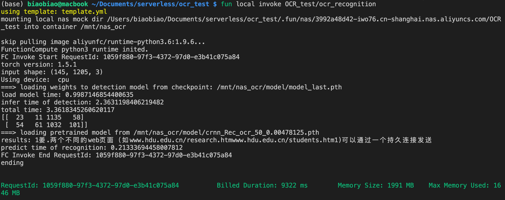
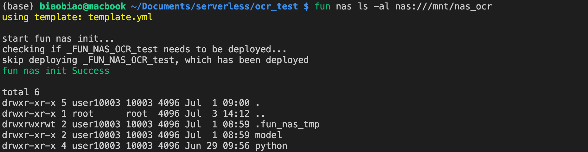
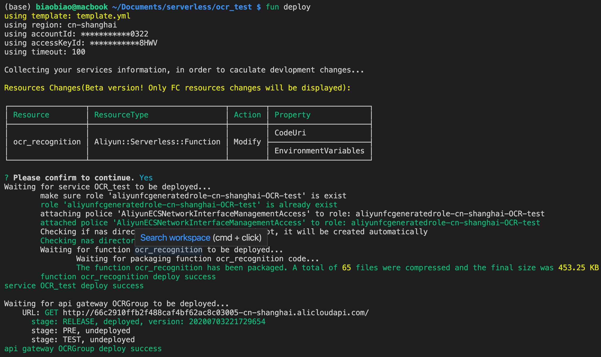
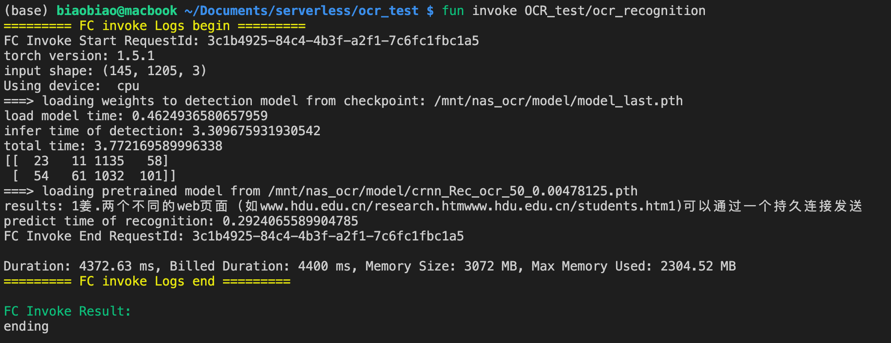

# 函数计算部署步骤

## 概述

本部分介绍使用函数计算部署深度学习 AI 推理模型，包括使用fun工具安装第三方依赖、本地调试、一键部署、对接 API 网关。

## 一、准备工作

1. 开通阿里云服务  
[开通函数计算](https://www.aliyun.com/product/fc?spm=5176.10695662.h2v3icoap.32.4a7b1a25b79N5C)，按量付费，函数计算目前有2核3G的免费额度  
[开通文件存储服务NAS](https://www.aliyun.com/product/nas?spm=5176.cnfc.h2v3icoap.41.18f6224eri9P5I)，按量付费  
[开通专有网络VPC](https://www.aliyun.com/product/vpc?spm=5176.59209.h2v3icoap.68.124d1d7ev8EDiI)

2. 本地配置  
[安装Docker](https://www.docker.com)，函数计算本地调试依赖Docker  
[安装部署工具funcraft](https://github.com/aliyun/fun/blob/master/docs/usage/installation-zh.md)，目前最新版本为 3.6.14
。在第一次使用 fun 之前需要先执行```fun config```进行配置，按照提示，依次配置 Account ID、Access Key Id、Secret Access Key、 Default Region Name 即可。其中 Account ID、Access Key Id 可从函数计算控制台首页的右上方获得。

## 二、部署

### 2.1 配置

Fun 是一个用于支持 Serverless 应用部署的工具，能便捷地管理函数计算、API网关、日志服务等资源。它通过一个资源配置文件（template.yml），协助进行开发、构建、部署操作。

1. 将 .env_example 复制为 .env ，并根据自己账号的信息配置；
2. 在 Funfile 中描述安装第三方依赖的命令，后续 ```fun install``` 时根据 Funfile 描述安装依赖；
3. 在工程目录下创建一个 template.yml 模板文件，fun 会将该目录视为一个工程。该配置文件参数可参考 GitHub: [Serverless Application Model](https://github.com/alibaba/funcraft/blob/master/docs/specs/2018-04-03-zh-cn.md) ；
4. 在 template.yml 所在的目录放置一个 .funignore 文件，打包 zip 文件的时候可以排除掉 .funignore 内描述的文件或者文件夹。.funignore 遵从 .gitignore 的语法。

> 各文件作用解释：  
> |文件|作用|
> |---|---|
> |.env|对 fun 进行配置|
> |Funfile|安装第三方库的描述文件|
> |.funignore|fun deploy 部署到函数计算忽略的文件|
> |template.yml|资源配置文件，描述 serverless 应用|
> |.fun|fun install 后下载的第三方库保存目录|

### 2.2 安装第三方库

将第三方库下载到本地的.fun文件夹下：

```bash
fun install -v
```



使用```docker images```查看安装的Docker镜像文件：



根据 Funfile 的定义：

* 将第三方库下载到 ```.fun/nas/xxxxxxxx-iwo76.cn-shanghai.nas.aliyuncs.com/OCR_test/python``` 目录下
* 本地 model 目录移到 ```.fun/nas/xxxxxxxx-iwo76.cn-shanghai.nas.aliyuncs.com/OCR_test/model``` 目录下

安装完成后,函数计算引用的代码包解压之后远超过 50M 代码包限制，解决方案是挂载 NAS 访问，幸运的是 fun 工具一键解决了 NAS 的配置和文件上传问题。

### 2.3 本地调试

fun local invoke在本地执行函数：

```bash
fun local invoke OCR_test/ocr_recognition
```



### 2.4 将第三方依赖上传到NAS

```bash
fun nas init
fun nas info
fun nas sync
fun nas ls nas:///mnt/nas_ocr
```

依次执行这些命令，就将本地中的 .fun/nas 中的第三方代码包和模型文件传到 NAS 中, 依次看下这几个命令的做了什么事情:

* fun nas init: 初始化 NAS, 基于 .env 中的信息获取(已有满足条件的NAS)或创建一个同region可用的NAS
* fun nas info: 可以查看本地 NAS 的目录位置
* fun nas sync: 将本地 NAS 中的内容上传到 NAS 中的 nas_ocr 目录
* fun nas ls nas:///mnt/nas_ocr: 查看我们是否已经正确将文件上传到了 NAS



### 2.5 部署至函数计算平台

将代码部分部署函数计算平台：

```bash
fun deploy
```



在云端执行函数：

```bash
fun invoke
```



至此，函数计算部署完成，但是API网关及其调试尚未完善。

### 参考链接🔗

[1] [基于函数计算+TensorFlow的Serverless AI推理](https://help.aliyun.com/document_detail/146724.html?spm=5176.cnfc.0.0.18f6224eri9P5I)  
[2] Github: [alibaba/funcraft](https://github.com/alibaba/funcraft)